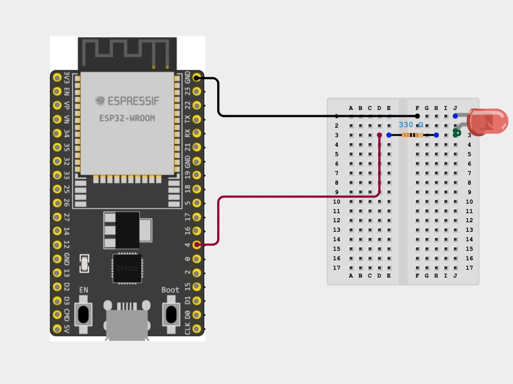

# Unit 1: GPIO output and the LED

## Learning goal

Explain how a digital output controls an LED and why the circuit needs a
current-limiting resistor.

## Build the circuit

Disconnect USB power. Connect GPIO 4 to a 330 Ω resistor, connect the resistor
to the LED anode, and connect the LED cathode to GND.



The resistor limits current through the LED. It can be placed on either side of
the LED because the same current flows through every component in this series
circuit. The LED itself is polarized: its anode and cathode cannot be swapped.

## Follow the code

Open `esp32_ble_led/board_config.h`. Both supported board families define GPIO 4
as `PIN_LED`. Then find these lines in `setup()` inside
`esp32_ble_led/esp32_ble_led.ino`:

```cpp
pinMode(PIN_LED, OUTPUT);
digitalWrite(PIN_LED, LED_OFF_LEVEL);
```

`pinMode` chooses the electrical role of the pin. `digitalWrite` selects one of
two logic levels. In this project, `HIGH` turns the external LED on and `LOW`
turns it off.

## Experiment

1. Predict the LED state immediately after the ESP32 starts.
2. Upload the firmware and compare the result with the prediction.
3. Temporarily exchange `LED_ON_LEVEL` and `LED_OFF_LEVEL` in
   `board_config.h`, upload again, and observe the change.
4. Restore the original values before continuing.

## Discuss

- Why does an LED need a resistor while a push button does not?
- What changes in software if a board uses an active-low built-in LED?
- Why are pin numbers kept in `board_config.h` instead of repeated throughout
  the firmware?

## Success check

You can identify the LED's anode and cathode, explain the resistor's purpose,
and point to the two statements that configure and initialize the GPIO output.
