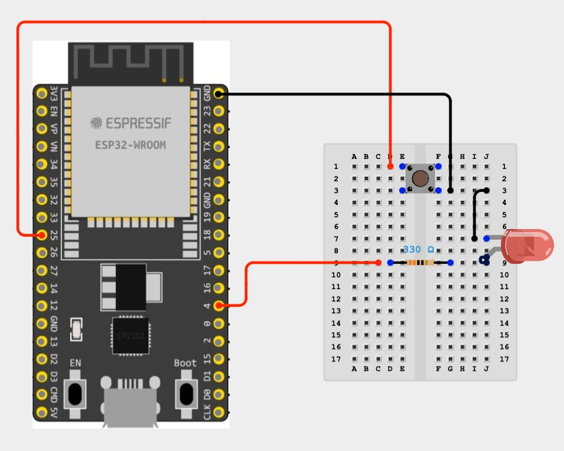

# Unit 4: digital input and the push button

## Learning goal

Explain an active-low input and use the ESP32's internal pull-up resistor to
read a physical button reliably.

## Add the input

Disconnect USB power before changing the circuit. Keep the LED from Unit 1,
then connect the button between the configured button GPIO and GND.



| Board | Button GPIO |
| --- | ---: |
| ESP32-WROOM | 25 |
| ESP32-C3 | 3 |

The source of truth for this mapping is `esp32_ble_led/board_config.h`.

## Understand `INPUT_PULLUP`

The firmware configures the input with:

```cpp
pinMode(PIN_BUTTON, INPUT_PULLUP);
```

An internal resistor weakly connects the pin to 3.3 V. With the button
released, the input reads `HIGH`. Pressing the button connects the pin directly
to GND, so it reads `LOW`.

| Button | Electrical connection | Reading |
| --- | --- | --- |
| Released | Internal pull-up to 3.3 V | `HIGH` |
| Pressed | Direct connection to GND | `LOW` |

This is called **active-low** because the action is represented by the low
logic level. It avoids a floating input without requiring an extra resistor on
the breadboard.

## Experiment

1. Before powering the board, predict the reading for a released button.
2. Add a temporary `Serial.println(raw);` after the `digitalRead` call in
   `handleButton()`.
3. Upload the sketch and observe the values while pressing and releasing.
4. Remove the temporary print so Serial Monitor remains readable for later
   lessons.

## Discuss

- What could happen if the input were configured as plain `INPUT` with no
  external resistor?
- Why does pressing the button produce `LOW` instead of `HIGH`?
- Why does the ESP32-C3 use a different input pin?

## Success check

You can predict the input reading for both button positions and explain the
complete current path created by `INPUT_PULLUP`.
